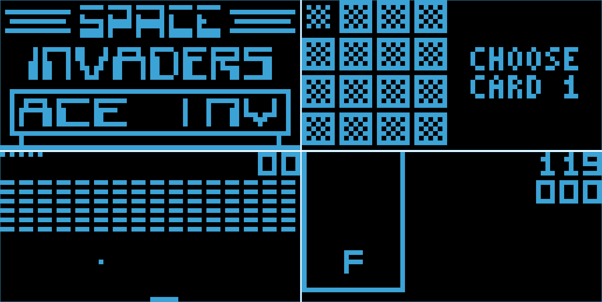

# 🕹️ Chip8 Emulator


This is a Chip8 emulator written in Rust, capable of running most Chip8 games.



## 🚀 Usage

### Prerequisites

To run the emulator, ensure you have the following installed on your system:

1. **Rust**: Follow the installation instructions from the [official Rust website](https://www.rust-lang.org/tools/install).
2. **SDL2 Library**: . On Ubuntu, you can install it by running:

   ```bash
   sudo apt-get install libsdl2-dev
   ```

### Running the Emulator

Once the prerequisites are installed, follow these steps:

1. Clone this repository:

   ```bash
   git clone https://github.com/Juannbel/chip8-emulator.git
   cd chip8-emulator
   ```

2. Run the emulator with the following command:

   ```bash
   cargo run --release <path_to_rom>
   ```

   Replace `<path_to_rom>` with the path to the Chip8 ROM you want to run. Sample ROMs are available in the `roms` directory within the project.

### Controls

<table>
<tr><th>Chip8 Keypad</th><th>Emulator keyboard Mapping</th></tr>
<tr><td>

|   |   |   |   |
|---|---|---|---|
| 1 | 2 | 3 | C |
| 4 | 5 | 6 | D |
| 7 | 8 | 9 | E |
| A | 0 | B | F |

</td><td>

|   |   |   |   |
|---|---|---|---|
| 1 | 2 | 3 | 4 |
| Q | W | E | R |
| A | S | D | F |
| Z | X | C | V |
</td></tr>
</table>

## References

- **Cowgod's Chip-8 Technical Reference v1.0**: This was the primary resource used to implement the emulator. You can access it [here](http://devernay.free.fr/hacks/chip8/C8TECH10.HTM).
- **Chip8 Test Suite**: Test ROMs used to verify emulator functionality were sourced from the [Chip8 Test Suite repository](https://github.com/Timendus/chip8-test-suite).
